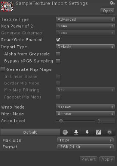

# PrinterPluginPro for Unity3D

## Introduction

Printer plugin allow you send textures from Unity to your printer with various options. Great for interactive kiosks and other installations, where you need something printed.

## How to use

Prepare texture for printing \(Texture MUST be uncompressed 24bit or 32bit and read/write enabled!\)



Use following code to print you texture on default printer.

```
PrinterPluginPro.print(texture,true, PrintScaleMode.FILL_PAGE);
```

You can also print multiple textures into one document, just use code below and pass textures array.

```text
 PrinterPluginPro.printMultiple(pagesTexture, true, PrintScaleMode.PAGE_WIDTH);
```

Please check included Demo.cs script for more how-to examples.

